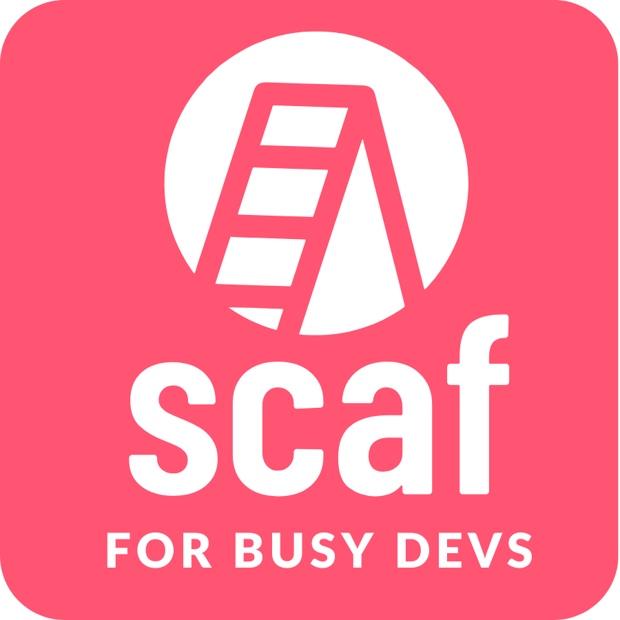

<p align="center">
  
</p>

**scaf** is a template manager that simplifies bootstrapping and updating projects.

## Features:

- 📥 Installs any template from any GitHub repo
- 🔄 Updates existing projects installed from Copier templates

## Currently available templates:

- 🏗️ [Six Feet Up Full Stack Template](https://github.com/sixfeetup/scaf-fullstack-template.git)
- 🪶 [Six Feet Up AWS Lambda App Template](https://github.com/sixfeetup/scaf-aws-lambda-app-template.git)

## Installation

Installation is supported on Linux and macOS:

```
curl -sSL https://raw.githubusercontent.com/sixfeetup/scaf/main/install.sh | bash
```

The installation script will install kubectl, kind, Tilt and uv if it can't be
found on your system.

### Nix

If you are a Nix user, you can install `scaf` using the following commands.

#### Permanent Installation

To install `scaf` into your user profile so it is available in all your shell sessions, run:

```bash
nix-env -if https://github.com/sixfeetup/scaf/archive/v1.26.2.zip
```

#### Temporary Shell

To use `scaf` in a temporary shell session without modifying your user profile, run:

```bash
nix-shell -p "(with import <nixpkgs> {}; callPackage (builtins.fetchTarball https://github.com/sixfeetup/scaf/archive/v1.26.2.zip) {})"
```

## Creating a new project using this repo

Run `scaf myproject`, answer all the questions, and you'll have your new
project!

Refer to the documentation of the template you installed.

## Usage

```
Usage: scaf project_slug [OPTIONS] [TEMPLATE]

Scaf - Project scaffolding CLI tool

Arguments:
  project_slug           The name of your new project (alphanumeric, -, _)

Options:
  --help, -h             Show this help message and exit
  --uninstall            Uninstall Scaf CLI from the system
  --upgrade              Upgrade Scaf to the latest version

Template:
  TEMPLATE               (Optional) Template source. Must be one of the following:
                          - https://github.com/sixfeetup/scaf-fullstack-template.git
                          - https://github.com/sixfeetup/scaf-aws-lambda-app-template.git
                          - Or a local path (e.g. ./my-template)
                          If omitted, you will be prompted to choose.

Advanced Copier Options:
  --defaults             Use default answers to template questions
  --vcs-ref <branch>     Use a specific Git branch/tag/commit from the template repo

Examples:
  scaf my-app
      # Creates a project named "my-app" and prompts to choose a template interactively.

  scaf my-app https://github.com/sixfeetup/scaf-fullstack-template.git
      # Creates "my-app" using the Fullstack template directly from GitHub.

  scaf my-app --defaults --vcs-ref main https://github.com/sixfeetup/scaf-aws-lambda-app-template.git
      # Creates "my-app" using the AWS Lambda template with defaults and from the 'main' branch.

  scaf my-app --defaults --vcs-ref main \$REPO_URL
      # Example with full path to CLI, using defaults and specific VCS reference.
      # REPO_URL must be one of the allowed template URLs above.
```

## Contributing

Please see [CONTRIBUTING.md](CONTRIBUTING.md) for details on how to contribute.
