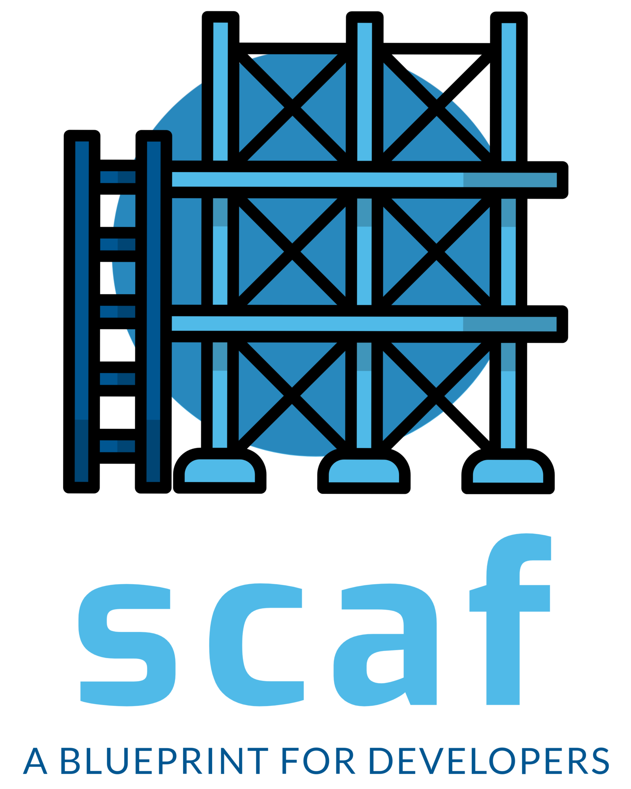

<p align="center">
  
</p>

**scaf** provides developers and DevOps engineers with a complete blueprint for
a new project and streamlines the development experience with Tilt.

**scaf** generates a new project structure with Kubernetes manifests in
three Kustomize layers for dev, sandbox, and production. A new project
contains the following:

- Django backend
- Celery (optional)
- Next.js frontend (optional)
  - Strawberry GraphQL (if frontend is chosen)
  - Apollo Client (if frontend is chosen)
  - _TODO: REST alternative to GraphQL_
- Postgres database for local development
- CloudNativePG deployment for production
- Redis
- Mailhog
- ArgoCD
- Traefik
- Certmanger
- Certificates and Ingress Routes
- Kube Prometheus Stack
- Grafana Loki
- GitHub and Bitbucket pipelines to build and push images, run security,
  formatting and linting checks
- Terraform config to set up a k3s cluster on AWS
- Sentry (optional)

## Installation

Installation is supported on Linux and macOS:

```
curl -sSL https://raw.githubusercontent.com/sixfeetup/scaf/main/install.sh | bash
```

The installation script will install kubectl, kind, and Tilt if it can't
be found on your system.

## Creating a new project using this repo

NB: Before you continue, make sure that you have at least 5 to 10 GB of free
space available to Docker. Note that Docker Desktop on MacOS has its own
resource limits separate from the host.

Run `scaf myproject`, answer all the questions, and you'll have your new project!

Inside `myproject/README.md`, you will have more
documentation explaining how to use and configure your newly created project.

## Terraform and AWS

To deploy your project using Terraform and AWS, you can follow the instructions in `terraform/README.md.`  
Note that you will need:

- an AWS account where you have access to the `OrganizationAccountAccessRole`
- terraform, and AWS CLI installed and configured

## Development on Scaf

### Nix Flake

Scaf provides a Nix Flake to install all the required packages for development.
The Nix Flake ensures all developers are using the same versions of all packages
to develop on Scaf in an isolated environment.

Follow the instructions to install
[Nix](https://nixos.org/download/#download-nix) for your OS.

Nix Flakes are a feature that comes with Nix, but they are considered
experimental and are not enabled by default in stable releases of Nix. To use
Nix Flakes, you need to enable them by configuring your Nix installation to
allow experimental features.

1. Ensure you have a recent version of Nix installed:

Nix Flakes are available in recent versions of Nix. You can check your Nix
version using:

```sh
nix --version
```

If you need to install or update Nix, you can follow the instructions on the Nix
installation page.

2. Enable experimental features:

You need to enable the experimental features in your Nix configuration. To do
this, add the following lines to your ~/.config/nix/nix.conf file. If the file
doesn't exist, you can create it:

```ini
experimental-features = nix-command flakes
```

3. Using Nix Flakes:

Once you have enabled the experimental features, you can use Nix Flakes with the
nix command. For example:

```sh
nix flake show
```

This command will display information about the flake in the current directory
if you have a flake.nix file.

Finally, install [Direnv](https://direnv.net/) and run `direnv allow`. The
direnv configuration in `.envrc` will use the flake to install the required
packages.

### Django version updates

When making changes to scaf, keep the following in mind:

- update pins in requirements/*.in files but *don't\* commit the compiled requirements.txt
  files to the repo.
- update to the latest Python supported by Django. For Django 4.1, this is 3.8, 3.9, and 3.10.

### Testing

To test the cookiecutter portion of Scaf, run the `./test-scaf.sh` script.

If you are not using the Nix development environment, create a virtual environment and
install black, isort and cookiecutter before running `./test-scaf.sh`.

Running `./test-scaf.sh -h` shows the usage instructions:

```shell
Usage: ./test-scaf.sh [-b <branch_name>] [-o <output_folder>] [-c <config_file>] [-h]
  -b <branch_name>    Optional: Specify the branch to test (default is local checkout)
  -o <output_folder>  Optional: Specify the output folder (default is /tmp/scaf-test)
  -c <config_file>    Optional: Specify the config file (default is ./test-configs/nextjs-django-github.yaml)
  -h                  Show this help message
```

Feel free to add more useful test configurations to `./test-configs/`.
