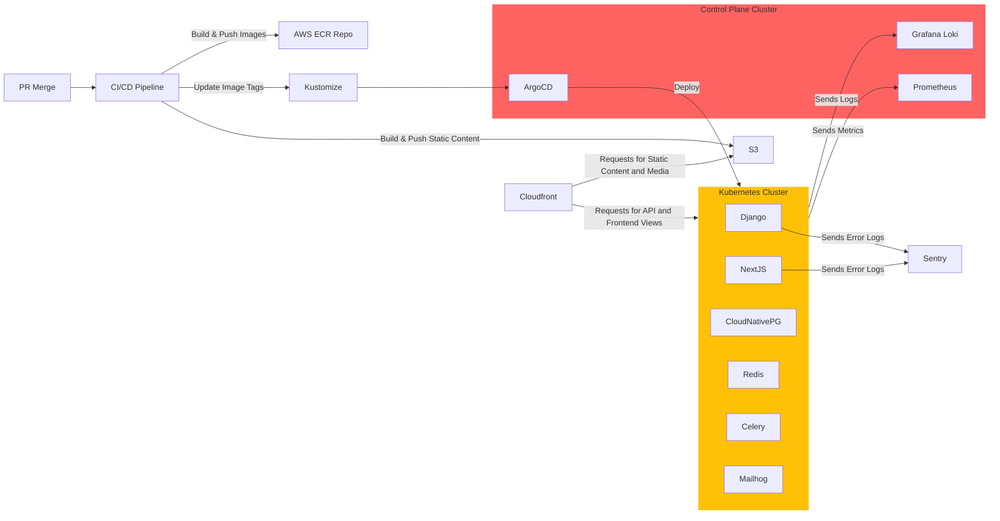

# The Sixie Opinionated Django Cookiecutter

This is a work in progress, but it is heavily inspired by the work
of [cookiecutter-django](https://github.com/pydanny/cookiecutter-django)
and Daniel Roy Greenfeld. It also borrows heavily from the ideas in the
PyPA [warehouse](https://github.com/pypa/warehouse) as I feel they have
made an amazing developer onboarding experience for a very complicated
project.

## Installing cookiecutter

To use this template, you need to install
[cookiecutter](https://cookiecutter.readthedocs.io/en/stable/) first. You can follow the
[instructions](https://cookiecutter.readthedocs.io/en/stable/installation.html) for your operating system.

The quickest way is performing a [user install](https://pip-python3.readthedocs.io/en/stable/user_guide.html#user-installs)
using the following command:

  $ python3 -m pip install --user cookiecutter

To verify if your install worked, you can use the following command (the versions may be
different for you):

  $ cookiecutter --version
  
  Cookiecutter 2.1.1 from /home/user/.local/lib/python3.10/site-packages (Python 3.10.6 (main, Nov 14 2022, 16:10:14) [GCC 11.3.0])

You will also need [black](https://pypi.org/project/black/) and [isort](https://pypi.org/project/isort/). You can install them using the commands:

  $ python3 -m pip install --user black
  
  $ python3 -m pip install --user isort

## Creating a new project using this repo

With [cookiecutter](https://cookiecutter.readthedocs.io/en/stable/) installed
in your environment you can create a new project with the command:

  $ cookiecutter https://github.com/sixfeetup/cookiecutter-sixiedjango/ -o [project_destination_directory]

Answer all the questions, and you'll have your new project!

Inside `[project_destination_directory]/[project_slug]/README.md` you will have more
documentation explaining how to use and configure your newly created project.

## Architecture

Here is what a cookiecutter deployment looks like in practice:



## Terraform and AWS

In order to deploy your project using terraform and AWS you can follow the instructions in `terraform/README.md`.  
Note that you will need:
- an AWS account where you have access to the `OrganizationAccountAccessRole`
- terraform and aws cli installed and configured 

## Development on the Cookie Cutter

When making changes to the Cookie Cutter, keep the following in mind:

- update pins in requirements/*.in files but *don't\* commit the compiled requirements.txt
  files to the repo.
- update to latest Python supported by Django. For Django 4.1 this is 3.8, 3.9, and 3.10.

## Python Libraries

This template includes the Python libraries listed below. Some of them
will be installed only if requested when answering the questions in the project creation.

- [argon2-cffi](https://github.com/hynek/argon2_cffi) - enables the use of the Argon2 password hasher in Django, as [recommended](https://docs.djangoproject.com/en/4.1/topics/auth/passwords/#using-argon2-with-django) by Django docs.
- [celery](https://github.com/celery/celery) - Distributed Task Queue
- [crispy-bootstrap5](https://pypi.org/project/crispy-bootstrap5/) - Bootstrap5 template pack for django-crispy-forms.
- [django](https://www.djangoproject.com/) - The web framework for perfectionists with deadlines.
- [django-allauth](https://github.com/pennersr/django-allauth) - set of Django applications addressing authentication, registration, account management, as well as 3rd party (social) account authentication. It assumes you are using regular Django Templates.
- [django-anymail](https://pypi.org/project/django-anymail/) - Django email backends for different providers such as Amazon SES, Mailgun, SMTP, etc.
- [django-celery-beat](https://github.com/celery/django-celery-beat) - Celery Periodic Tasks backed by the Django ORM.
- [django-compressor](https://github.com/django-compressor/django-compressor) - Compresses linked and inline javascript or CSS into a single cached file.
- [django-cors-headers](https://github.com/adamchainz/django-cors-headers) - Django app for handling the server headers required for Cross-Origin Resource Sharing (CORS). Needs to be configured for [REST framework](https://www.django-rest-framework.org/topics/ajax-csrf-cors/#cors).
- [django-crispy-forms](https://github.com/django-crispy-forms/django-crispy-forms) - improve rendering of Django forms. It assumes that you are using regular Django Templates.
- [django-environ](https://django-environ.readthedocs.io/en/stable/) -  allows you to utilize 12-factor inspired environment variables to configure your Django application. It is being used in all project settings files.
- [django-model-utils](https://django-model-utils.readthedocs.io/en/stable/) - mixins and utilities for your project. It is not explicitly used in our generated project but is available for use in your project.
- [django-redis](https://github.com/jazzband/django-redis) - Full-featured Redis cache backend for Django.
- [django-storages](https://pypi.org/project/django-storages/) - Support multiple storage backends in Django.
- [djangorestframework](https://github.com/encode/django-rest-framework) - Django REST framework is a powerful and flexible toolkit for building Web APIs.
- [drf-spectacular](https://github.com/tfranzel/drf-spectacular) - Sane and flexible OpenAPI 3 schema generation for Django REST framework. Useful when testing and developing APIs.
- [flower](https://github.com/mher/flower) - Real-time monitor and web admin for Celery distributed task queue.
- [redis](https://github.com/redis/redis-py) - Redis Python client. Required by Celery as we use Redis as [broker](https://docs.celeryq.dev/en/stable/getting-started/backends-and-brokers/redis.html#using-redis)
- [Pillow](https://pypi.org/project/Pillow/) - Python Imaging Library. Required if we have `models.ImageField` fields in our project.

## Development using Kubernetes

This section describes the local development using [Kubernetes](https://kubernetes.io).

### Requirements

To work with Kubernetes you need to install some additional software packages. Depending on your operating system, the installation instructions may vary.

The following tools are required:

- `kubectl` to manage the Kubernetes cluster
- `skaffold` for local development with Kubernetes
- `minikube,` `kind,` or `Docker Desktop` to run the Kubernetes cluster

We will use [minikube](https://minikube.sigs.k8s.io/docs/start/) to create the cluster. For macOS, [Docker](https://docs.docker.com/get-docker/) is a good fit with most compatibility (VirtualBox currently has some issues).

The installation of `kubectl,` `kind,` and `minikube` is described in the [Kubernetes Tools installation docs](https://kubernetes.io/docs/tasks/tools/).

For Mac using Docker and Homebrew, it would be the following:

1. Install Docker: https://docs.docker.com/get-docker/
1. `brew install kubectl minikube skaffold`

For Ubuntu Linux, it would be the following:

1. Install Docker: https://docs.docker.com/get-docker/
2. Install Kubectl: https://kubernetes.io/docs/tasks/tools/install-kubectl-linux/
3. Install minikube: https://minikube.sigs.k8s.io/docs/start/
4. Install Skaffold standalone binary: https://skaffold.dev/docs/install/

### Starting the cluster

1. Ensure `Docker` is running:
   ```
   docker ps
   CONTAINER ID   IMAGE                                 COMMAND                  CREATED        STATUS        PORTS                                                                                                                        NAMES
   ```
1. Start `minikube`:

   ```
   minikube start --memory 8192 --cpus 2
   😄  minikube v1.28.0 on Darwin 13.1
   ✨  Using the docker driver based on existing profile
   👍  Starting control plane node minikube in cluster minikube
   🚜  Pulling base image ...
   🏃  Updating the running docker "minikube" container ...
   🐳  Preparing Kubernetes v1.25.3 on Docker 20.10.20 ...
   🔎  Verifying Kubernetes components...
       ▪ Using image docker.io/kubernetesui/dashboard:v2.7.0
       ▪ Using image gcr.io/k8s-minikube/storage-provisioner:v5
       ▪ Using image docker.io/kubernetesui/metrics-scraper:v1.0.8
   💡  Some dashboard features require the metrics-server addon. To enable all features please run:

     minikube addons enable metrics-server


   🌟  Enabled addons: storage-provisioner, default-storageclass, dashboard
   🏄  Done! kubectl is now configured to use "minikube" cluster and "default" namespace by default
   ```

   NOTE: we start minikube with more memory since the default of 2Gb is not enough to run the whole stack comfortably.

1. Optional: Start the `minikube` dashboard in a second terminal:
   ```
   minikube dashboard
   🤔  Verifying dashboard health ...
   🚀  Launching proxy ...
   🤔  Verifying proxy health ...
   🎉  Opening http://127.0.0.1:60284/api/v1/namespaces/kubernetes-dashboard/services/http:kubernetes-dashboard:/proxy/ in your default browser...
   ```
1. Copy the example configmap:
   ```
   cp ./k8s/django.configmap.yaml.example ./k8s/django.configmap.yaml
   ```
1. Deploy the cluster using `skaffold`:
   ```
   skaffold dev
   ```
   🎉 After some time, Loudswarm will be deployed to your local minikube cluster. In the terminal output, you will also find the information about the **forwarded ports**:
   ```
   Deployments stabilized in 16.132 seconds
   Port forwarding service/loudswarm-frontend in namespace default, remote port 80 -> http://127.0.0.1:4503
   Port forwarding service/django in namespace default, remote port 8000 -> http://127.0.0.1:8000
   Port forwarding service/mailhog in namespace default, remote port 8025 -> http://127.0.0.1:8025
   Press Ctrl+C to exit
   Watching for changes...
   ```

To stop the development cluster, terminate the process with `CTRL-C`.

### Minikube tips

1. Ensure that minikube registry addon is enabled:

   ```
   minikube addons enable registry
   ```

### Using Kind instead of Minikube for local Kubernetes cluster creation

Kind is another tool that will help us run a Kubernetes cluster locally. It runs the cluster in Docker containers and starts up faster on Linux.

Refer to https://kind.sigs.k8s.io/docs/user/quick-start/#installation for installation instructions.

1. Create the cluster with kind:

   ```
   $ kind create cluster
   Creating cluster "kind" ...
   ✓ Ensuring node image (kindest/node:v1.25.3) 🖼
   ✓ Preparing nodes 📦
   ✓ Writing configuration 📜
   ✓ Starting control-plane 🕹️
   ✓ Installing CNI 🔌
   ✓ Installing StorageClass 💾
   Set kubectl context to "kind-kind"
   You can now use your cluster with:

   kubectl cluster-info --context kind-kind

   ```

1. Run Skaffold:

   ```
   $ skaffold dev
   ```

   Since Kind is using Docker, we can see that after Skaffold builds the images, they are available on the system:

   ```
   $ docker image list
   REPOSITORY                                                      TAG                                                                IMAGE ID       CREATED          SIZE
   853934023701.dkr.ecr.us-east-1.amazonaws.com/loudswarm-django   18dc615cf828c9cce9486e8ddf26267dbedf61a9f28d365ae1b0614647a126a2   18dc615cf828   21 minutes ago   681MB
   853934023701.dkr.ecr.us-east-1.amazonaws.com/loudswarm-django   latest                                                             18dc615cf828   21 minutes ago   681MB
   853934023701.dkr.ecr.us-east-1.amazonaws.com/loudswarm-react    6e2c1f5ed0d3bea2a7536593538b64e1609bd99005e77d84a2f3e5488c57700d   6e2c1f5ed0d3   26 minutes ago   596MB
   853934023701.dkr.ecr.us-east-1.amazonaws.com/loudswarm-react    latest                                                             6e2c1f5ed0d3   26 minutes ago   596MB
   ```

### Kubernetes Useful commands and tips

1. To check the deployed applications and services, use the `kubectl` command:

   ```
   kubectl get all
   NAME                                      READY   STATUS      RESTARTS      AGE
   pod/celeryworker-858c455c67-6m7tv         3/3     Running     2 (32m ago)   33m
   pod/django-9f776557-d797p                 1/1     Running     0             33m
   pod/django-migrations-job-f9lj5           0/1     Completed   0             33m
   pod/loudswarm-frontend-77947689d9-pg46t   1/1     Running     0             33m
   pod/mailhog-7f76b678d6-nvwqw              1/1     Running     0             33m
   pod/postgres-0                            1/1     Running     0             33m
   pod/redis-565b6b69cd-sxzx4                1/1     Running     0             33m

   NAME                         TYPE           CLUSTER-IP       EXTERNAL-IP   PORT(S)          AGE
   service/django               NodePort       10.102.254.57    <none>        8000:30803/TCP   33m
   service/kubernetes           ClusterIP      10.96.0.1        <none>        443/TCP          23h
   service/loudswarm-frontend   NodePort       10.100.220.156   <none>        80:31847/TCP     33m
   service/mailhog              LoadBalancer   10.101.15.241    <pending>     8025:31934/TCP   33m
   service/postgres             ClusterIP      10.97.21.142     <none>        5432/TCP         33m
   service/redis                LoadBalancer   10.106.3.45      <pending>     6379:30300/TCP   33m

   NAME                                 READY   UP-TO-DATE   AVAILABLE   AGE
   deployment.apps/celeryworker         1/1     1            1           33m
   deployment.apps/django               1/1     1            1           33m
   deployment.apps/loudswarm-frontend   1/1     1            1           33m
   deployment.apps/mailhog              1/1     1            1           33m
   deployment.apps/redis                1/1     1            1           33m

   NAME                                            DESIRED   CURRENT   READY   AGE
   replicaset.apps/celeryworker-858c455c67         1         1         1       33m
   replicaset.apps/django-9f776557                 1         1         1       33m
   replicaset.apps/loudswarm-frontend-77947689d9   1         1         1       33m
   replicaset.apps/mailhog-7f76b678d6              1         1         1       33m
   replicaset.apps/redis-565b6b69cd                1         1         1       33m

   NAME                        READY   AGE
   statefulset.apps/postgres   1/1     33m

   NAME                              COMPLETIONS   DURATION   AGE
   job.batch/django-migrations-job   1/1           38s        33m
   ```

1. You can inspect the logs of deployed pods using `kubectl logs` and the `id` of the pod:

   ```
   kubectl logs pod/django-9f776557-d797p
   Defaulted container "django" out of: django, check-db-ready (init)

   You have 163 unapplied migration(s). Your project may not work properly until you apply the migrations for app(s): chat, conference, django_celery_beat, edi, knox, sessions, webhooks.
   Run 'python manage.py migrate' to apply them.
   * Running on all addresses.
     WARNING: This is a development server. Do not use it in a production deployment.
   * Running on http://172.17.0.4:8000/ (Press CTRL+C to quit)
   * Restarting with stat
   Performing system checks...

   System check identified no issues (0 silenced).

   Django version 3.2.16, using settings 'config.settings.local'
   Development server is running at http://0.0.0.0:8000/
   Using the Werkzeug debugger (http://werkzeug.pocoo.org/)
   Quit the server with CONTROL-C.
   * Debugger is active!
   * Debugger PIN: 810-798-763
   ```

1. To run a command within one of the `pods` (e.g. creating a Django user), you can log in into the running `container` in a `pod`:
   ```
   kubectl exec -it pod/django-9f776557-d797p -- /bin/bash
   Defaulted container "django" out of: django, check-db-ready (init)
   root@django-9f776557-d797p:/app/src# python manage.py createsuperuser
   ```

### Kubernetes Lens

Kubernetes Lens (https://k8slens.dev/) has a graphical user interface to explore a cluster, check logs, etc.

### Kubernetes cluster removal

If you stop skaffold with CTRL-C, it will automatically delete everything inside the cluster. It will not remove the persisted storage for `postgres`. To start with a clean database, you need to remove the persisted volume in `minikube`:

```
minikube ssh
docker@minikube:~$ pwd
/home/docker
docker@minikube:~$ cd /mnt/postgres-data
docker@minikube:/mnt/postgres-data$ ls
pgdata
docker@minikube:/mnt/postgres-data$ sudo rm -rf pgdata
```

To stop `minikube`, run `minikube stop`.
