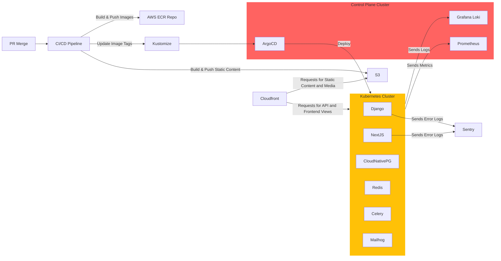

<p align="center">
  
</p>

**scaf** provides developers and DevOps engineers with a complete blueprint for
a new project and streamlines the development experience with Tilt.

**scaf** generates a new project structure with Kubernetes manifests in
three Kustomize layers for dev, sandbox, and production. A new project 
contains the following:
* React frontend
* Django backend
* Postgres database for local development
* CloudNativePG deployment for production
* Redis
* Mailhog
* ArgoCD 
* Traefik
* Certmanger
* Certificates and Ingress Routes
* Kube Prometheus Stack
* Grafana Loki
* GitHub and Bitbucket pipelines to build and push images, run security,
formatting and linting checks
* Terraform config to set up a k3s cluster on AWS

## Installation

Installation is supported on Linux and macOS:
```
curl -sSL https://raw.githubusercontent.com/sixfeetup/scaf/main/install.sh | sh
```

The installation script will install kubectl, kind, and Tilt if it can't
be found on your system.

## Creating a new project using this repo

Run `scaf myproject`, answer all the questions, and you'll have your new project!

Inside `myproject/README.md`, you will have more
documentation explaining how to use and configure your newly created project.

## Architecture

Here is what a cookiecutter deployment looks like in practice:


```mermaid
flowchart LR
    PR["PR Merge"] --> CIDCD["CI/CD Pipeline"]
    CIDCD -->|Build & Push Images| AWSECR["AWS ECR Repo"]
    CIDCD -->|Update Image Tags| Kustomize
    CIDCD -->|Build & Push Static Content| S3
    Kustomize --> ArgoCD
    Cloudfront
    S3
    subgraph ControlPlaneCluster["Control Plane Cluster"]
        Loki["Grafana Loki"]
        Prometheus
        ArgoCD
    end
    subgraph K8sCluster["Kubernetes Cluster"]
        Django
        NextJS
        CloudNativePG
        Redis
        Celery
        Mailhog
    end
    ArgoCD -->|Deploy| K8sCluster
    Sentry
    Django -->|Sends Error Logs| Sentry
    NextJS -->|Sends Error Logs| Sentry
    K8sCluster -->|Sends Logs| Loki
    K8sCluster -->|Sends Metrics| Prometheus
    Cloudfront -->|Requests for API and Frontend Views| K8sCluster
    Cloudfront -->|Requests for Static Content and Media| S3

    style K8sCluster fill:#FFC107, stroke:#FFFFFF, stroke-width:1px
    style ControlPlaneCluster fill:#ff6361, stroke:#FFFFFF, stroke-width:1px

```

## Terraform and AWS

To deploy your project using Terraform and AWS, you can follow the instructions in `terraform/README.md.`  
Note that you will need:
- an AWS account where you have access to the `OrganizationAccountAccessRole`
- terraform, and AWS CLI installed and configured 

## Development on scaf

When making changes to scaf, keep the following in mind:

- update pins in requirements/*.in files but *don't\* commit the compiled requirements.txt
  files to the repo.
- update to the latest Python supported by Django. For Django 4.1, this is 3.8, 3.9, and 3.10.

